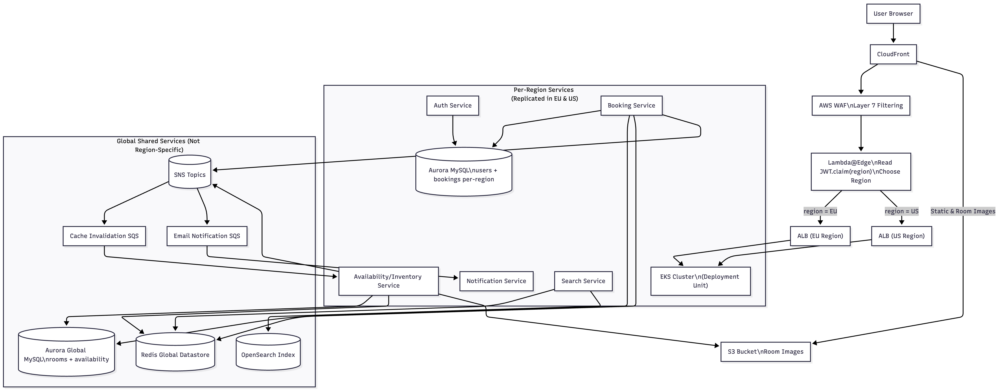
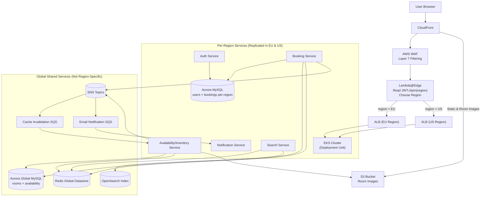
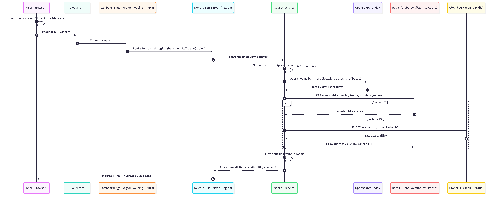
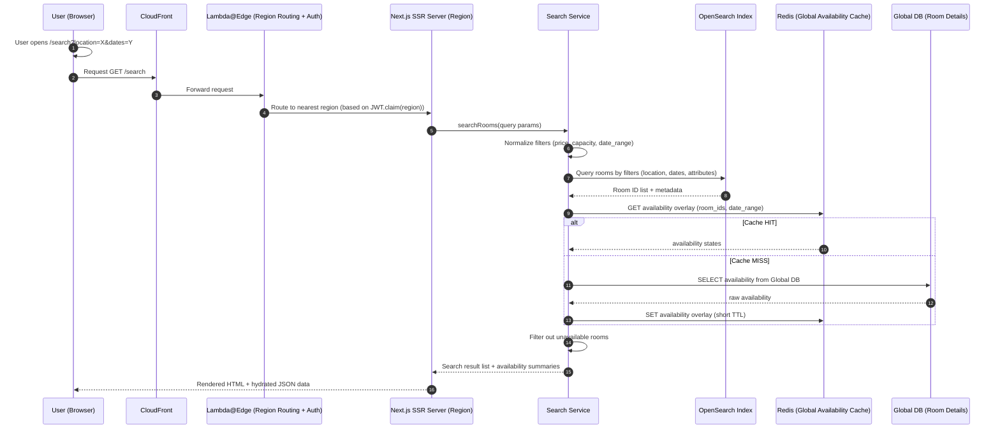
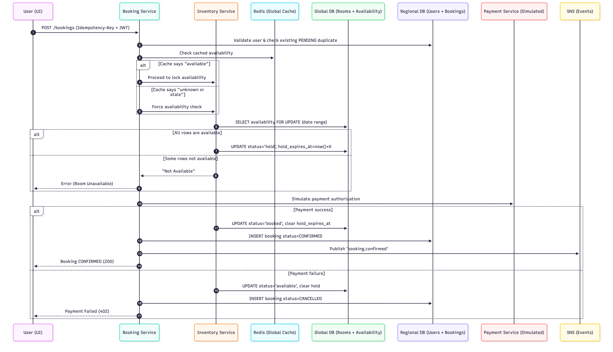
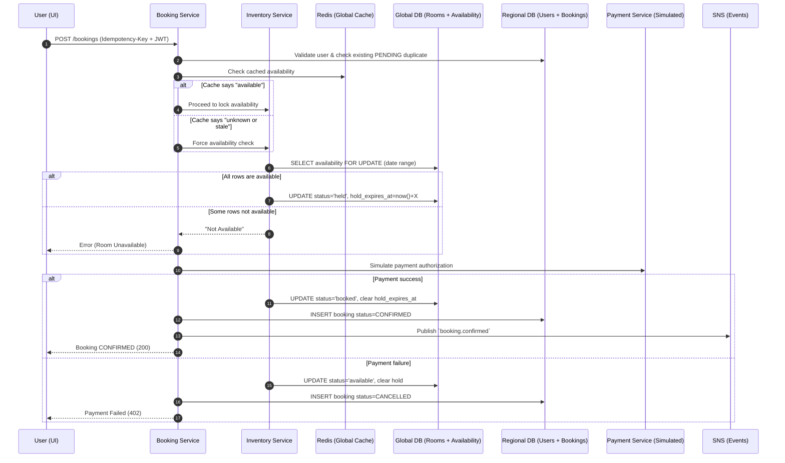

# 🏨 Room Booking Platform — High Level Design (HLD)

## 1. Overview

This document describes a **multi-region, fault-tolerant Room Booking Platform**.  
The platform supports:

- User registration and authentication
- Room discovery and filtered search
- Booking & cancellation flows
- Viewing booking history

The system is designed for:

- **Global availability consistency** (no double bookings)
- **Low-latency user experience** (EU & US hosting)
- **Operational resilience and scalability**

---

## 2. High-Level Architecture

### Key Principles

- **One global domain**: `my-booking.com`
- **Users are served from their region** (EU or US)
- **Room availability is global**, ensuring a **single source of truth**
- **User data and bookings follow data residency rules** (stored per-region)

### Component Overview

| Layer            | Technology                                      | Purpose                                                            |
| ---------------- | ----------------------------------------------- | ------------------------------------------------------------------ |
| CDN & Routing    | CloudFront + Lambda@Edge                        | Determines user’s region and routes requests accordingly           |
| Frontend         | Next.js (SSR + CSR)                             | SEO-friendly room listings, fast UX, hydration for dynamic pages   |
| Backend Services | Node.js on EKS                                  | Booking, Rooms, Auth, Notification, Search                         |
| Regional DBs     | Aurora MySQL (EU + US)                          | User accounts & booking records (regional)                         |
| Global DB        | Aurora Global MySQL                             | Room catalog & availability (single source of truth)               |
| Cache            | **Global Redis (ElastiCache Global Datastore)** | Cached views for availability & search                             |
| Search           | OpenSearch                                      | Scalable search index for room discovery                           |
| Messaging        | SNS + SQS                                       | Decoupled async propagation (cache invalidation, indexing, emails) |
| Payments         | **Simplified Payment Service**                  | Tokenized card handling                                            |

### Architecture Diagram





---

## 3. Why SSR (Next.js) + Region Routing

| Requirement                             | Why SSR Helps                             |
| --------------------------------------- | ----------------------------------------- |
| **SEO for public room pages**           | HTML is fully rendered server-side        |
| **Fast first page load**                | No initial SPA "loading spinner"          |
| **Authentication via HttpOnly cookies** | SSR layer can read session state securely |
| **Multi-region hosting**                | Rendering happens close to the user       |

**Rendering Strategy**
| Page Type | Render Mode | Reason |
|----------|-------------|--------|
| Room page `/rooms/:id` | **SSR / Server Components** | SEO + fast render |
| Search results | **SSR for initial load + CSR hydration** | Performance + interactivity |
| Booking flow | **Client-side only** | Payment UI and PCI compliance |
| User dashboard | **SSR + cookie auth** | Fast & secure account views |

---

## 4. Authentication

Uses **HttpOnly, Secure, SameSite=Lax cookies** for access + refresh tokens.  
Works seamlessly with **SSR** and prevents XSS session theft.

---

## 5. Database Schema

### Users

```sql
CREATE TABLE users (
  id BIGINT PRIMARY KEY AUTO_INCREMENT,
  email VARCHAR(255) UNIQUE NOT NULL,
  password_hash VARCHAR(255) NOT NULL,
  first_name VARCHAR(100),
  last_name VARCHAR(100),
  created_at TIMESTAMP DEFAULT CURRENT_TIMESTAMP,
  updated_at TIMESTAMP DEFAULT CURRENT_TIMESTAMP ON UPDATE CURRENT_TIMESTAMP
);
```

### Rooms

```sql
CREATE TABLE rooms (
  id BIGINT PRIMARY KEY AUTO_INCREMENT,
  title VARCHAR(255) NOT NULL,
  description TEXT,
  location JSON NOT NULL,
  price DECIMAL(10,2) NOT NULL,
  capacity INT NOT NULL,
  amenities JSON,
  images JSON,
  INDEX idx_price (price),
  INDEX idx_capacity (capacity)
);
```

### Availability (Global)

```sql
CREATE TABLE availability (
  room_id BIGINT NOT NULL,
  date DATE NOT NULL,
  status ENUM('available','held','booked') NOT NULL DEFAULT 'available',
  hold_expires_at DATETIME NULL,
  version INT DEFAULT 0,
  PRIMARY KEY (room_id, date)
);
```

### Bookings (Regional)

```sql
CREATE TABLE bookings (
  id BIGINT PRIMARY KEY AUTO_INCREMENT,
  user_id BIGINT NOT NULL,
  room_id BIGINT NOT NULL,
  check_in DATE NOT NULL,
  check_out DATE NOT NULL,
  guests INT NOT NULL,
  status ENUM('PENDING','CONFIRMED','CANCELLED','EXPIRED') DEFAULT 'PENDING',
  total_price DECIMAL(10,2) NOT NULL,
  idempotency_key VARCHAR(255) UNIQUE NOT NULL,
  payment_intent_id VARCHAR(255),
  INDEX idx_user (user_id),
  INDEX idx_room_dates (room_id, check_in, check_out)
);
```

---

## 6. Concurrency Handling

```sql
SELECT * FROM availability
 WHERE room_id=?
 AND date BETWEEN ? AND ?
 FOR UPDATE;
```

- If all dates available → mark `held`
- Payment succeeds → mark `booked`
- Payment fails or times out → release hold

---

## 7. Caching Strategy

| Key                             | TTL     | Purpose                  |
| ------------------------------- | ------- | ------------------------ |
| `availability:{roomId}:{range}` | 30–120s | Fast calendar updates    |
| `room:{roomId}:details`         | 5–30m   | Faster SSR               |
| `search:{queryHash}`            | 30–300s | Faster repeated searches |

Invalidation triggered via SNS events.

---

## 8. Event-Driven Messaging (SNS → SQS)

| Event                  | Purpose                        |
| ---------------------- | ------------------------------ |
| `booking.created`      | Confirmation email + analytics |
| `booking.cancelled`    | Release availability + notify  |
| `availability.updated` | Cache invalidation             |
| `room.updated`         | Reindex in search              |

---

## 9. Payments (Simplified)

- Booking request triggers **immediate simulated payment**.
- No secondary confirmation step required.
- Booking changes state:

```
PENDING → CONFIRMED   or   PENDING → CANCELLED
```

---

## 10. Scalability & Fault-Tolerance

| Layer           | Scaling Strategy                                  |
| --------------- | ------------------------------------------------- |
| API Services    | EKS + HPA autoscaling                             |
| Searches        | OpenSearch shards / replicas                      |
| Cache           | Redis Global Datastore                            |
| DB              | Aurora Global DB with regional replicas           |
| Traffic Routing | CloudFront + Lambda@Edge for region-aware routing |

---

## 11. User Flows

### Search Flow





### Booking Flow





---

## 12. Future Enhancements

- Dynamic pricing
- Waitlists
- Personalized recommendations

---
